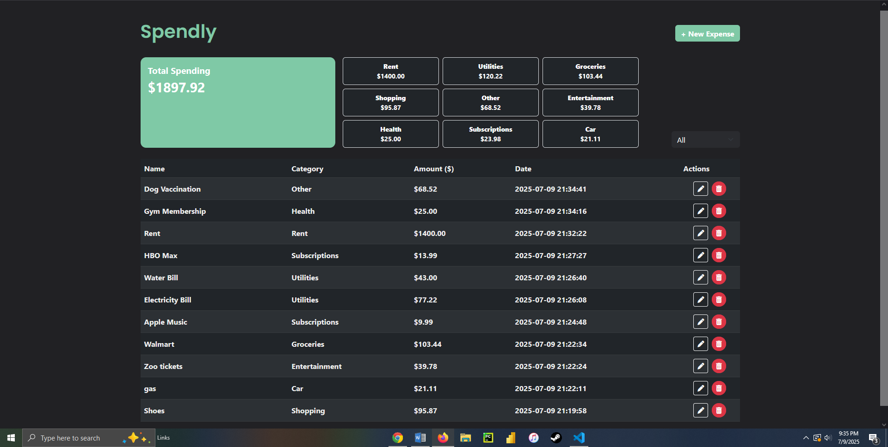
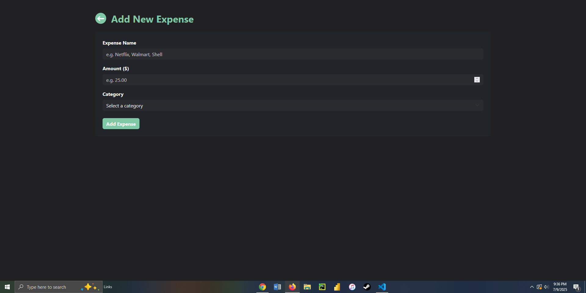

# 💸 Spendly – Expense Tracker Web App

Spendly is a sleek, minimalistic expense tracking web application built with **Flask**, **SQLite**, **HTML**, **CSS**, **JavaScript**, and **Bootstrap**. Designed with a mobile-inspired look and feel, Spendly lets users easily add, view, edit, delete, and filter expenses by category — all from a modern, responsive interface.

> 🧠 Ideal for tracking monthly expenses, spending patterns, and budgeting goals without requiring an account or third-party service.

---

## ✨ Features

- 💾 Persistent data storage using SQLite
- ➕ Add new expenses with name, amount, and category
- 🗂️ Predefined categories: Groceries, Car, Utilities, Subscriptions, etc.
- 📝 Edit or delete individual expenses
- 📅 Expenses are automatically timestamped
- 💰 Summary of total spending and spending by category
- 🔎 Filter expenses by category
- 💻 Fully responsive + modern Bootstrap UI
- 🌙 Dark mode-friendly design

---

## 🛠️ Tech Stack

- **Python** (Flask micro-framework)
- **SQLite** (local lightweight database)
- **Bootstrap 5** (styling & layout)
- **HTML5** + **CSS3**
- **Jinja2** (Flask templating engine)

---

## Screenshots

  

  


## 📁 File Structure

```
spendly/
│
├── static/
│   └── styles.css          # Custom styling (colors, spacing, typography)
│
├── templates/
│   ├── index.html          # Main homepage with expenses table, summary, filters
│   ├── add_expense.html    # Page to create a new expense
│   └── edit_expense.html   # Page to update/edit an existing expense
│
├── expenses.db             # SQLite database storing expense records
├── requirements.txt        # Python dependencies
└── app.py                  # Flask application logic
```

---

## ▶️ How to Run Locally

### 1. Clone the repository:
```bash
git clone https://github.com/your-username/spendly.git
cd spendly
```

### 2. Create and activate a virtual environment:
```bash
python -m venv venv
source venv/bin/activate   # On Windows: venv\Scripts\activate
```

### 3. Install dependencies:
```bash
pip install -r requirements.txt
```

### 4. Run the app:
```bash
python app.py
```

The app will be available at `http://127.0.0.1:5000`.

---

## 🧠 How It Works

### `app.py` – Main Flask App
- Initializes the SQLite database if it doesn’t exist
- Routes:
  - `/` – Homepage that shows all expenses, total summary, category summaries, and a category filter
  - `/add` – Form to add a new expense
  - `/edit/<id>` – Edit page to modify an existing expense
  - `/delete/<id>` – Deletes a specific expense
- Uses Jinja2 templating to dynamically render the UI

### `templates/` – Front-End Pages
- **index.html**: Shows all data, filter, total & category summaries
- **add_expense.html**: Form with input fields (name, amount, category)
- **edit_expense.html**: Same form pre-filled with existing data for editing

### `static/styles.css`
- Custom colors, fonts, rounded buttons, and layout overrides to match a clean, dark aesthetic

---

## 📊 Future Improvements

- User authentication (login/logout)
- Monthly budget limits or goals
- Data visualization (charts with Chart.js or D3)
- Export to CSV
- Mobile-first design enhancements

---


```
Example layout:
+----------------------------+      +----------------------------+
|     Total Spending Box     |      |  Spending by Category      |
|        $450.25             |      |  Groceries: $210           |
+----------------------------+      |  Utilities: $90            |
                                    |  Subscriptions: $30        |
                                    +----------------------------+

+---------------------------------------------------------------+
|               | Netflix | Subscriptions | $15 | 07/08/2025 | 🖊️ 🗑️ |
|               | Walmart | Groceries     | $60 | 07/08/2025 | 🖊️ 🗑️ |
|               | PG&E    | Utilities     | $90 | 07/08/2025 | 🖊️ 🗑️ |
+---------------------------------------------------------------+
```

---
