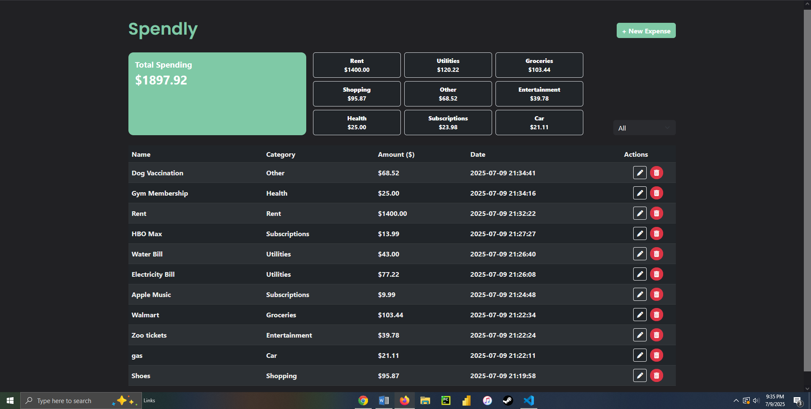
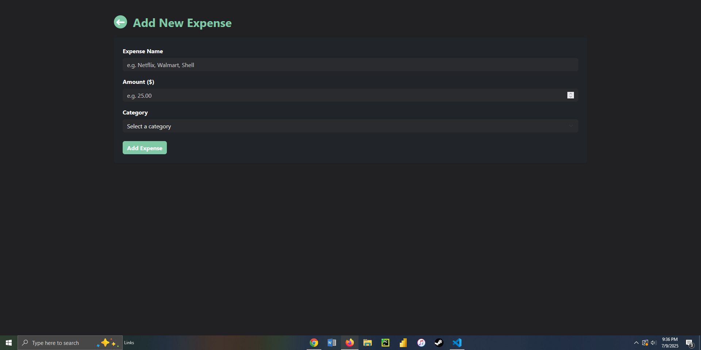

# Spendly – Expense Tracker Web App

Spendly is a simple and modern expense tracking web application built with FastAPI, SQLite, Jinja2, Bootstrap 5, and vanilla JavaScript. It lets users log, view, edit, and delete expenses with ease, all within a responsive and clean user interface enhanced by interactive features.

## Features

- Add new expenses with description, amount, category, and auto timestamp
- Edit or delete existing expenses with confirmation prompts
- View all expenses in a sortable table
- See **total spending** and a **category breakdown**
- Instantly filter expenses by category with client-side filtering using vanilla JavaScript
- Dark-mode UI with Bootstrap 5 styling

---

## Tech Stack

- **Python** with [FastAPI](https://fastapi.tiangolo.com/)
- **SQLite** database via SQLAlchemy ORM
- **Jinja2** for HTML templating
- **Bootstrap 5** for UI and responsiveness
- **JavaScript** for client-side interactivity
- **Uvicorn** for running the FastAPI server

---

##  Project Structure

expense-tracker/
│
├── main.py                # FastAPI app with route definitions
├── crud.py                # CRUD logic for interacting with the DB
├── models.py              # SQLAlchemy models
├── database.py            # DB engine & session setup
│
├── templates/
│   ├── base.html          # Shared layout 
│   ├── index.html         # Home page: expenses table, summaries, filter
│   ├── add_expense.html   # Form to add a new expense
│   └── edit_expense.html  # Form to edit existing expense
│
├── static/
│   └── style.css          # Custom styles (colors, spacing, etc.)
│
├── expenses.db            # SQLite database (auto-generated)
├── requirements.txt       # Project dependencies
└── README.md              # Project info

## Screenshots

  

  

---

## Getting Started

### 🔧 Option 1: Run Locally

### 1. Clone the repository

git clone https://github.com/your-username/expense-tracker.git
cd expense-tracker

2. Create a virtual environment

python -m venv venv
source venv/bin/activate      # Windows: venv\Scripts\activate

3. Install dependencies

pip install -r requirements.txt

Or manually:

pip install fastapi uvicorn sqlalchemy jinja2

4. Run the application

uvicorn main:app --reload

The app will be available at:
 http://127.0.0.1:8000

Option 2: Run with Docker

# 1. Build the Docker image
docker build -t spendly .

# 2. Run the container
docker run -d -p 8000:8000 spendly

App will be available at:
 http://localhost:8000

## How It Works

# main.py – FastAPI App
  Defines all routes:

  /: Homepage (shows table, summaries, filters)

  /add: Add new expense form

  /edit/{id}: Edit form with pre-filled data

  /delete/{id}: Deletes a selected expense

  Handles optional category filtering using query parameters

  Passes dynamic values to Jinja2 templates

# crud.py – Data Logic
  Contains helper functions like:

  get_expenses()

  add_expense()

  update_expense()

  delete_expense()

  Uses SQLAlchemy sessions to interact with the SQLite database

# models.py – Database Model
  Defines the Expense table with fields:

  id

  description

  amount

  category

  date (auto timestamp)

  index.html – Main UI Page
  Displays:

  A table of all expenses

  Total spending summary

  Spending by category

  Category filter dropdown

  "Add Expense" button

  Styled using Bootstrap + custom CSS

# add_expense.html & edit_expense.html
  Forms to submit or update expense records

  Includes dropdown for predefined categories

Example UI Layout

+----------------------------+      +----------------------------+      +--------------------+
|     Total Spending         |      |  Spending by Category      |      |   [+] Add Expense   |
|        $450.25             |      |  Food: $210                |      +--------------------+
+----------------------------+      |  Utilities: $90            |
                                    |  Shopping: $80             |
                                    +----------------------------+

+---------------------------------------------------------------+
| Description | Category     | Amount | Date & Time      | Edit/Delete |
|------------ |------------- |--------|------------------|-------------|
| Netflix     | Entertainment| $15.00 | Jul 8, 2025 03:30 PM | ✏️ 🗑️     |
| Walmart     | Food         | $60.00 | Jul 7, 2025 10:12 AM | ✏️ 🗑️     |
+---------------------------------------------------------------+

